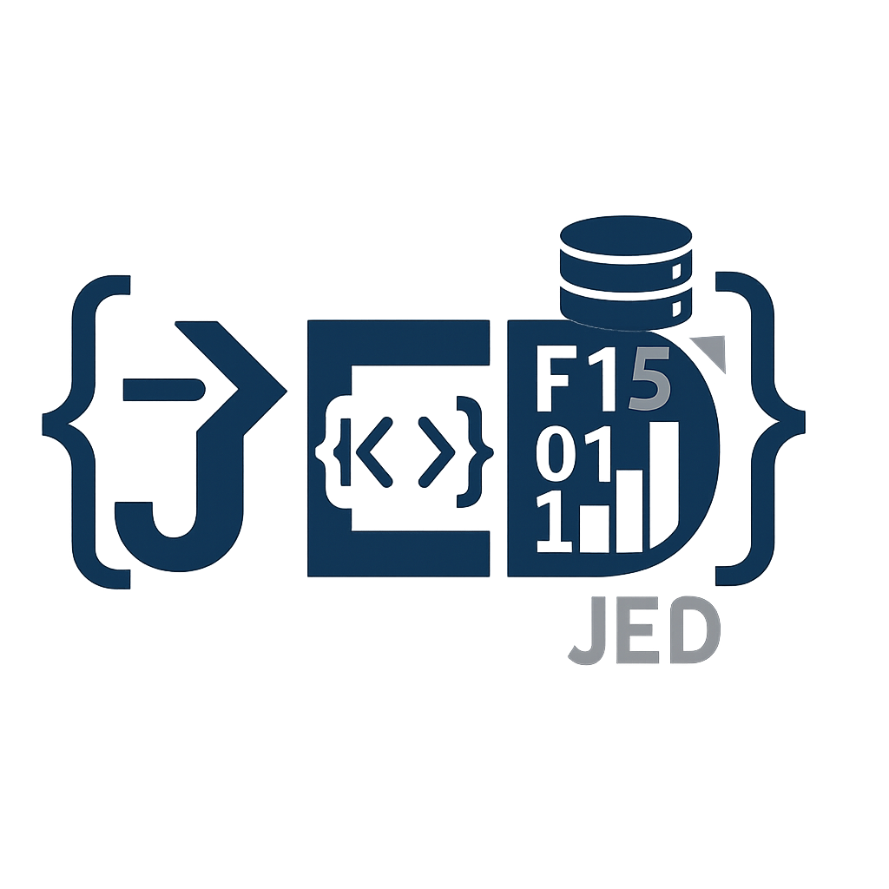

  

# Portafolio Profesional – JED (jedF15)

Bienvenido al portafolio de proyectos de **Juan Estuardo Deyet (JED)**, especialista en programación, automatización con Excel, análisis de datos y desarrollo de soluciones prácticas para ambientes académicos y empresariales.

---

## 📁 Estructura del portafolio

- **Excel_Macros**  
  Automatizaciones con VBA y dashboards interactivos en Excel, incluyendo reportes en PDF y validaciones inteligentes.

- **PowerBI_Reportes**  
  Informes analíticos con visualizaciones avanzadas sobre datos reales de exportaciones, comercio y rendimiento académico.

- **CSharp_Proyectos**  
  CRUD, conexión a MySQL, control académico y manejo de modelos en C# para escritorio.

- **assets**  
  Imágenes y recursos compartidos (como este logo profesional).

---

## 💡 Habilidades aplicadas

- Visual Basic para Aplicaciones (VBA)
- Power BI y Power Query
- Programación en C# y Python
- MySQL / SQL Server
- Automatización de reportes y generación de PDFs
- Uso avanzado de Excel (tablas dinámicas, segmentaciones, funciones matriciales)
- Actualizado por IA el 08/07/2025 17:37

---

## 📫 Contacto

📧 jdeyet@gmail.com  
🔗 [GitHub: jedF15](https://github.com/jedF15)

---
Conflicto resuelto en README.md

  <i>“No hay nada más poderoso que una mente organizada con macros y sentido común.”</i> 
  – JED

